# Honda 2-Wheeler Sales & Churn Risk Analytics Dashboard

<p align="center">
  
</p>

## Project Overview
This project presents an **end-to-end business analytics solution** built to monitor **Honda 2-wheeler sales performance, profitability, and customer churn risk patterns** using **Power BI, DAX, MySQL, and n8n automation**.

The solution combines:
- **Automated data ingestion**
- **Database integration**
- **Data modeling**
- **Interactive dashboarding**
- **Proxy churn risk analysis**

---

## Business Problem
Honda’s retail sales data contains valuable information related to:
- Customer transactions
- Pricing behavior
- Dealer operations
- Customer satisfaction
- Financing patterns

However, raw sales data alone does not directly provide business insights.

This project was designed to answer key business questions such as:

- Which bike models are driving the highest sales and profit?
- Which regions and payment modes contribute most to revenue?
- Which customer segments show higher churn risk?
- How do customer ratings and delivery delays affect retention risk?
- Which dealers may require intervention based on service and risk patterns?

---

## Project Objectives
The key objectives of this project were:

- Build a **live reporting pipeline** for sales data updates
- Create a centralized analytical model for dashboard reporting
- Track **sales, cost, and profitability KPIs**
- Simulate **customer churn risk analysis** using proxy variables
- Segment customers based on **behavioral and service-related factors**
- Deliver a visually intuitive dashboard for business decision-making

---

## Tech Stack
- **Power BI** – Dashboard development and data modeling
- **DAX** – Calculated columns, KPIs, and churn logic
- **MySQL** – Online database storage
- **n8n** – Workflow automation for live data ingestion

---

## Dataset Information
The dataset consists of **Honda 2-wheeler sales transaction records** and includes fields such as:

- Order ID
- Order Date
- Year / Month / Quarter
- State / City
- Dealer Name
- Sales Channel
- Bike Model / Segment / Engine CC / Color
- Customer Age / Gender
- Payment Mode
- On-Road Price / Discount / Finance Amount
- Insurance / Accessories / Exchange Bonus
- Net Sales / Cost Price / Gross Profit
- Delivery Days
- Customer Rating

> **Note:** The dataset did not include a unique `Customer_ID`, so direct repeat purchase tracking was not possible.  
> To address this, a **proxy churn risk framework** was developed using customer satisfaction, delivery performance, discount dependency, and financing behavior.

---

# Workflow

## 1) Automated Data Pipeline

<p align="center">
  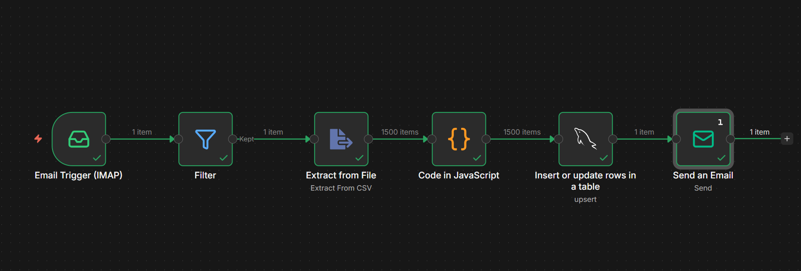
</p>

An **n8n automation workflow** was built to keep the reporting system live and reduce manual data handling.

### Workflow Steps:
- Read incoming emails
- Filter emails based on subject line
- Extract attached CSV files
- Transform date formats to match MySQL schema
- Insert cleaned records into an **online MySQL database**
- Enable Power BI dashboard refresh using the updated database

#### Database hosted on Adminer server
<p align="center">
  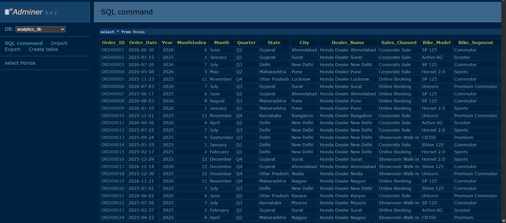
</p>

### Business Value:
- Reduced manual file handling
- Maintained consistent data formatting
- Supported near-live reporting workflow

---

## 2) Data Modeling in Power BI

After loading the data into Power BI, the dataset was modeled to support time-based and business-level analysis.

<p align="center">
  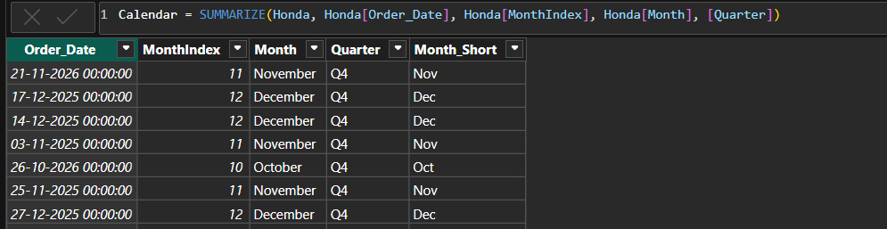
</p>

### Key modeling steps:
- Built a **Calendar Dimension Table**
- Linked transactional data with date hierarchy
- Prepared fields for trend analysis and filtering
- Created custom sorting columns for:
  - Month order
  - Age group order
  - Category display order

---

## 3) Feature Engineering using DAX
To support customer segmentation and churn-risk analysis, several **derived columns and business logic fields** were created.

### Calculated / Categorized Fields:
- **Age Group**
```DAX
Age_Group =
SWITCH(
    TRUE(),
    'Sales'[Customer_Age] <= 25, "18-25",
    'Sales'[Customer_Age] <= 35, "26-35",
    'Sales'[Customer_Age] <= 45, "36-45",
    'Sales'[Customer_Age] <= 60, "46-60",
    "60+"
)
```
- **Delivery Delay Band**
```DAX
Delivery_Band = 
SWITCH(
    TRUE(),
    'Honda'[Delivery_Days] <= 3, "Fast Delivery",
    'Honda'[Delivery_Days] <= 7, "Normal Delivery",
    'Honda'[Delivery_Days] <= 14, "Delayed",
    "Highly Delayed"
)
```
- **Customer Rating Band**
```DAX
Rating_Band = 
SWITCH(
    TRUE(),
    'Honda'[Customer_Rating] >= 4.5, "Highly Satisfied",
    'Honda'[Customer_Rating] >= 4, "Moderately Satisfied",
    'Honda'[Customer_Rating] >= 3.5, "Low Satisfaction",
    "Highly Dissatisfied"
)
```
- **Discount Band**
```DAX
Discount_Band = 
SWITCH(
    TRUE(),
    'Honda'[Discount] = 0, "No Discount",
    'Honda'[Discount] <= 1500, "Low Discount",
    'Honda'[Discount] <= 3500, "Medium Discount",
    "High Discount"
)
```
- **Churn Risk Score**
```DAX
Churn_Risk_Score = 
VAR RatingScore =
    SWITCH(
        TRUE(),
        'Honda'[Customer_Rating] >= 4.5, 1,
        'Honda'[Customer_Rating] >= 4, 2,
        'Honda'[Customer_Rating] >= 3.5, 3,
        4
    )

VAR DeliveryScore =
    SWITCH(
        TRUE(),
        'Honda'[Delivery_Days] <= 3, 1,
        'Honda'[Delivery_Days] <= 7, 2,
        'Honda'[Delivery_Days] <= 14, 3,
        4
    )

VAR DiscountScore =
    SWITCH(
        TRUE(),
        'Honda'[Discount] = 0, 1,
        'Honda'[Discount] <= 1500, 2,
        'Honda'[Discount]<= 3500, 3,
        4
    )


RETURN
RatingScore + DeliveryScore + DiscountScore
```
- **Churn Risk Category**
  - High Risk
  - Medium Risk
  - Low Risk
```DAX
  Churn_Risk_Category = 
SWITCH(
    TRUE(),
    'Honda'[Churn_Risk_Score] <= 6, "Low Risk",
    'Honda'[Churn_Risk_Score] <= 9, "Medium Risk",
    "High Risk"
)
```
- **Retention Category**
  - Highly Retained
  - Moderately Retained
  - Retention Risk
```DAX
Retention_Category = 
VAR Retention_Score = 12 - 'Honda'[Churn_Risk_Score]
RETURN
SWITCH(
    TRUE(),
    Retention_Score >= 5, "Highly Retained",
    Retention_Score >= 3, "Moderately Retained",
    "Retention Risk"
)
```

### Churn Risk Logic
Since actual customer repetition data was unavailable, churn behavior was approximated using a **proxy risk framework** based on:

- Lower customer ratings
- Longer delivery delays
- Higher discount dependency
- Financing behavior
- Customer engagement indicators

This made it possible to build a **customer retention intelligence layer** despite the absence of direct customer lifecycle data.

---

# Dashboard Pages

## Page 1 – Sales Overview Dashboard
This page provides an executive summary of Honda 2-wheeler sales performance.

<p align="center">
  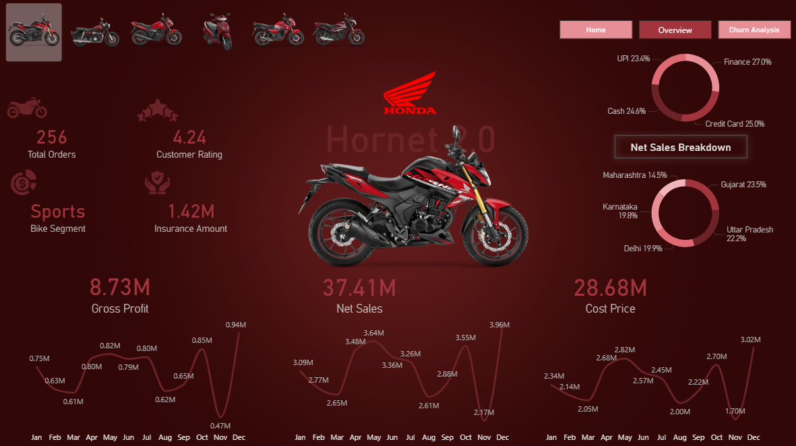
</p>

### KPIs Included:
<p align="center">
  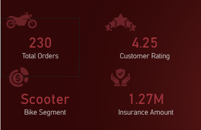
</p>


### Visualizations Included:
- #### **Donut Charts**
  - Net Sales by Bike Segments
  - State-wise Share of Sales
<p align="center">
  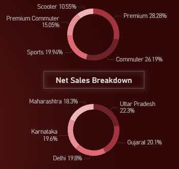
</p>
  
- #### **Line Charts**
  - Month-wise Gross Profit Trend
  - Month-wise Net Sales Trend
  - Month-wise Cost Price Trend
<p align="center">
  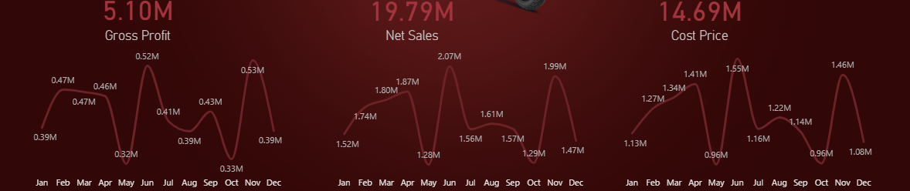
</p>

- #### **Model Display**
  - Dynamic bike image based on selected model
  
- #### **Interactive Navigation**
  - Page navigator for dashboard flow

### Filters / Slicers:
- Bike Model
<p align="center">
  
</p>

---

## Page 2 – Customer Churn Risk Analysis
This page focuses on identifying **high-risk customer segments** and analyzing factors contributing to churn propensity.

<p align="center">
  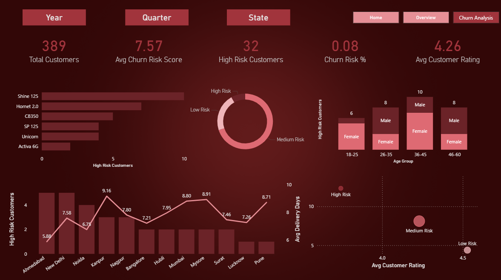
</p>

### KPIs Included:
- **Total Customers**
- **Average Churn Risk Score**
- **High Risk Customers**
- **Churn Risk Percentage**
- **Average Customer Rating**

### Visualizations Included:
- **Bar Chart**
  - High Risk Customers by Bike Model
<p align="center">
  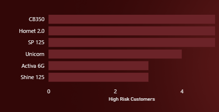
</p>
- **Donut Chart**
  - Customer Distribution by Risk Category
<p align="center">
  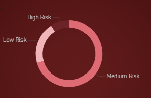
</p>
- **Stacked Column Chart**
  - High Risk Customers by Age Group and Gender
<p align="center">
  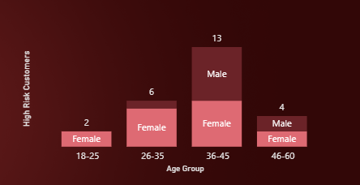
</p>
- **Line and Clustered Column Chart**
  - High Risk Customers by Dealer
  - Average Delivery Days by Dealer
<p align="center">
  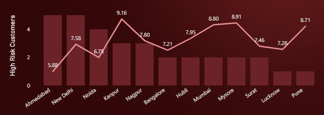
</p>
- **Scatter Plot**
  - Average Delivery Days vs Average Customer Rating
  - Bubble Size = High Risk Customer Count
<p align="center">
  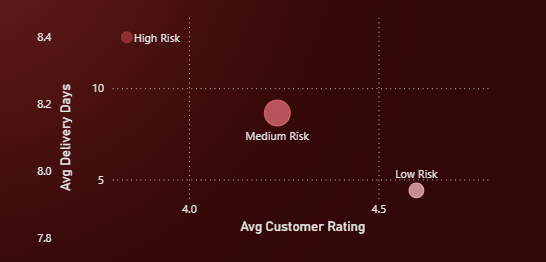
</p>

### Filters / Slicers:
- Year
<p align="center">
  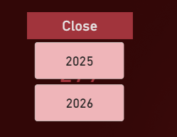
</p>
- Quarter
<p align="center">
  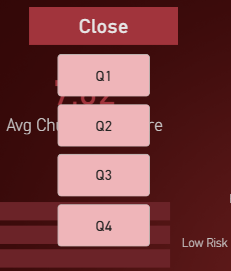
</p>
- State
<p align="center">
  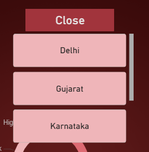
</p>

---

# Key Metrics / KPIs Used

## Sales Metrics
- Net Sales
- Gross Profit
- Total Cost Price
- Total Orders

## Customer Metrics
- Average Customer Rating
- High Risk Customer Count
- Churn Risk %
- Average Churn Risk Score

## Operational Metrics
- Delivery Delay
- Insurance Amount
- Finance Amount
- Discount Behavior

---

# Key DAX / Analytical Logic

## Examples of business logic implemented:
- Time intelligence using Calendar table
- Customer segmentation by age and satisfaction
- Delay and discount categorization
- Churn risk scoring using weighted conditional logic
- Retention classification based on churn score

---

# Challenges Faced

## 1) Lack of Customer ID
The biggest challenge in this project was the absence of a **unique customer identifier**, which made it impossible to directly measure:
- repeat purchases,
- exact customer churn,
- customer lifetime behavior.

### Solution:
A **proxy churn risk framework** was developed using:
- Delivery performance
- Customer ratings
- Discount dependence
- Customer segmentation behavior

This allowed meaningful **retention risk analysis** despite incomplete customer lifecycle data.

---

## 2) Raw Date Formatting for Database Ingestion
Incoming CSV files contained date formats that were not directly compatible with the MySQL schema.

### Solution:
A transformation step was added in the **n8n workflow** to standardize dates before insertion into the database.

---

## 3) Maintaining Dashboard Readiness
The data needed to remain reporting-ready without repeated manual cleaning.

### Solution:
An automated ETL-style process was created using:
- email filtering
- CSV extraction
- Transformation
- Direct database loading

---

# Key Insights

## Sales & Profitability Insights
- The Premium and Commuter bike segment are responsible for a Net Sales contribution of more than 50%.
- Net sales and gross profit followed a similar trend across the selected period, indicating that revenue growth was largely accompanied by profit generation.
- Certain months showed stronger sales spikes, suggesting possible seasonality or festive demand patterns in the 2-wheeler market.
- The gap between sales and cost remained stable across most months, suggesting consistent gross profitability in the business.
- Order concentration around selected bike segments especially Premium and Commuter segment, highlights clear product preference patterns among Honda buyers.
- Sales contribution was heavily concentrated across Uttar Pradesh and Gujarat, indicating that Honda’s revenue performance may be dependent on key regional markets.
- Model selection influences state-level demand patterns, indicating possible regional preference differences.
- A stable customer rating alongside healthy order volume suggests a balanced sales and service experience.

## Customer & Churn Risk Insights
- Honda’s overall churn risk remains relatively low (~8%), indicating a generally healthy retention profile, while still revealing targeted risk pockets across specific models, dealers, and customer segments.
- Shine 125 and Hornet 2.0 display the highest concentration of high-risk customers, pointing to possible gaps in product experience, pricing perception, or post-sales service quality.
- A large share of customers lies in the Medium Risk category, making this the most valuable segment for retention-focused interventions and customer experience improvement.

- The 26–45 age group represents the highest concentration of high-risk customers, while older customer groups also show elevated churn vulnerability, indicating the need for segment-specific retention strategies.

## Dealer / Operational Insights
- Dealer-level churn exposure is uneven, with cities such as Ahmedabad, New Delhi, and Noida showing elevated high-risk customer counts, suggesting that service quality and customer handling vary significantly across locations.
- Higher customer ratings and lower delivery times are consistently associated with lower churn risk, reinforcing the importance of service experience as a key retention driver.

---

# Business Recommendations

- Focus on high-performing models and regions while improving weaker markets through targeted dealer and marketing interventions.
- Convert medium-risk customers into low-risk customers through better service quality, delivery experience, and post-sales engagement.
- Standardize dealer-level customer experience to reduce churn risk caused by inconsistent service quality.
- Improve delivery efficiency, as longer delivery timelines are strongly associated with higher churn propensity.
- Adopt model-specific pricing, positioning, and retention strategies for products with higher customer risk exposure.
- Protect profitability by balancing sales growth with cost control and reduced discount dependency.

Overall, the analysis suggests that Honda can improve both profitability and customer retention by combining product-level strategy, dealer performance optimization, operational efficiency, and customer experience improvements.

---

# Outcome
This project demonstrates how **business intelligence, automation, and proxy analytical modeling** can be combined to create a **real-world portfolio project** with strong business relevance.

It showcases the ability to:
- Automate reporting workflows
- Model business-ready datasets
- Engineer analytical features
- Build decision-support dashboards for business use cases

---


