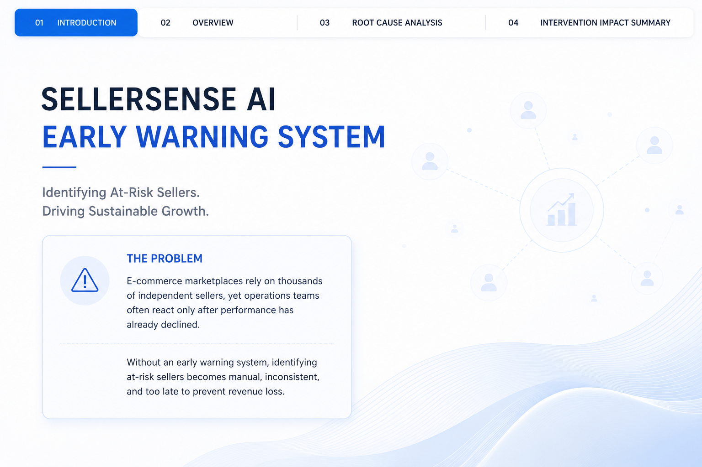
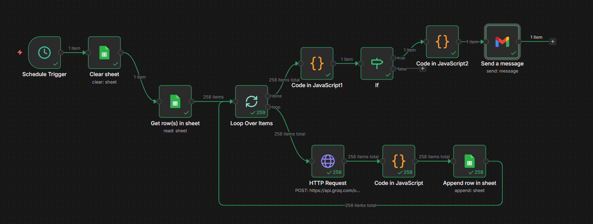
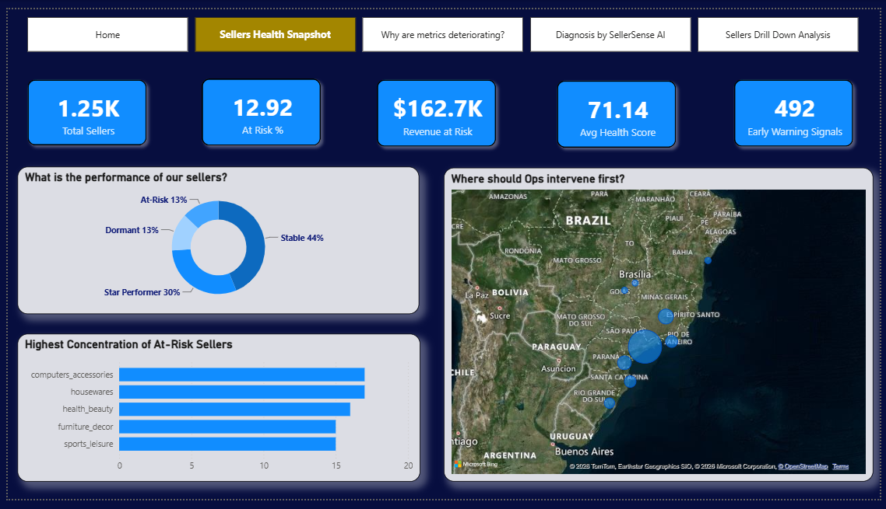
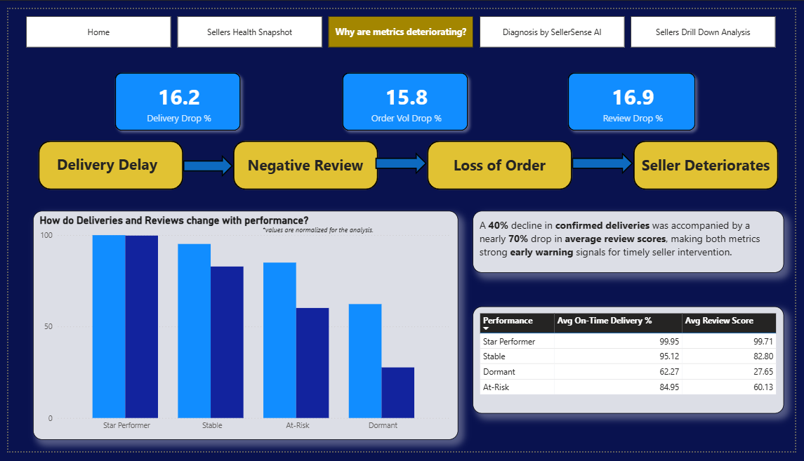
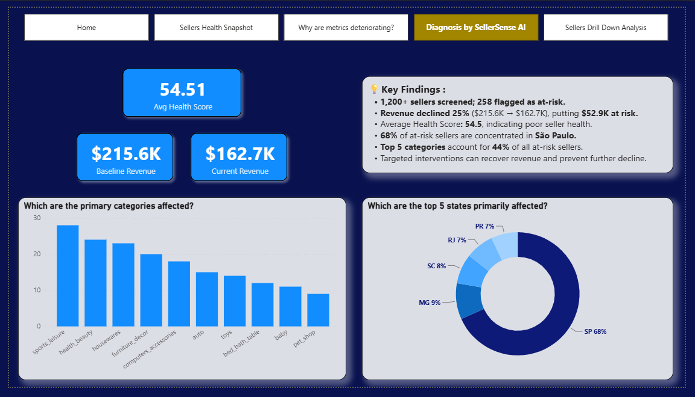
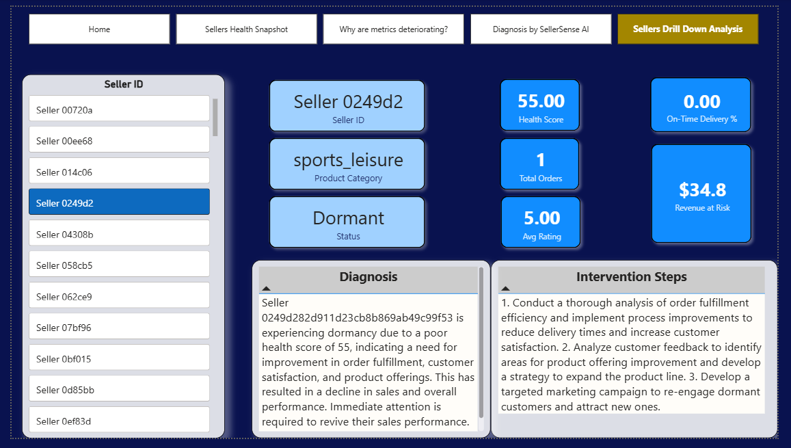

# SellerSense AI Copilot - Seller Health Diagnosis Model

<p align="center">
  
</p>

## Project Overview

This project presents an **end-to-end business analytics and AI automation solution** built to monitor **seller health, detect early warning signals, and deliver AI-generated intervention recommendations** for a Meesho-style marketplace platform.

The solution combines:
- **SQL-based metric engineering**
- **Python-based health scoring and segmentation**
- **AI agent automation via n8n**
- **Interactive Power BI dashboarding**

---

## Business Problem

In a marketplace like Meesho, thousands of sellers, mostly first-time micro-entrepreneurs, list and sell products daily. Seller ops teams currently work **reactively**: by the time a seller's ratings crash and order volume drops, the damage is already done.

Key questions this project answers:

- Which sellers are at risk of going dormant before it actually happens?
- What metric is declining first-> reviews, delivery, or order volume?
- Which sellers need immediate intervention vs. just monitoring?
- What specific action should the ops team take for each at-risk seller?
- Are multiple sellers in the same category declining together (systemic issue)?

---

## Project Objectives

- Engineer seller-level performance metrics from raw order transaction data
- Build a composite **Seller Health Score** (0–100) using a weighted formula
- Segment sellers into four health tiers using **percentile-calibrated thresholds**
- Detect **sharp metric drops** relative to each seller's own historical baseline
- Automate a weekly **AI Copilot pipeline** that generates per-seller diagnosis, intervention plan, and personalized outreach message
- Deliver an interactive **Power BI dashboard** for the ops team

---

## Tech Stack

- **SQL (MySQL)** — Metric engineering and aggregation pipeline
- **Python** — Health scoring, segmentation, early warning analysis (pandas, numpy, matplotlib, seaborn, scikit-learn)
- **n8n** — Workflow automation and AI agent orchestration
- **Groq API (LLaMA 3)** — AI-generated seller diagnosis and intervention
- **Google Sheets** — Intervention queue (input/output for n8n)
- **Power BI** — Dashboard and reporting layer

---

## Dataset Information

**Primary Dataset:** Olist Brazilian E-Commerce Dataset (Kaggle)
Used as a Meesho marketplace proxy -> small sellers, varied categories, review-driven trust system, delivery-dependent buyer experience.

**Tables Used (6):**

| Table | Key Columns | Purpose |
|---|---|---|
| orders | order_id, order_status, timestamps, delivery dates | Core order data |
| order_items | order_id, seller_id, product_id, price, freight_value | Links sellers to orders |
| order_reviews | order_id, review_score | Satisfaction metrics |
| products | product_id, product_category_name | Category diversity |
| sellers | seller_id, seller_state | Seller profile |
| category_translation | category_name, category_name_english | English category names |

> **Note:** Dataset covers Sep 2016 – Oct 2018. Analysis starts from Jan 2017 to exclude sparse early months. Only sellers with 10+ lifetime orders are included in health scoring to ensure meaningful trend analysis.

---

# Workflow

## 1) SQL : Metric Engineering Pipeline

A 7-CTE SQL pipeline was built in MYSQL to transform raw order-level data into a seller monthly metrics table.

### CTE Architecture

| CTE | Description | Output |
|---|---|---|
| base | All 6 tables joined into one flat structure | 1 row per order-item |
| seller_monthly | Metrics aggregated per seller per month | Core metrics table |
| seller_lifetime | Total lifetime orders per seller | Filter helper |
| seller_monthly_filtered | Filtered: 10+ lifetime orders, 2017+ | Clean dataset |
| seller_comparative | Added MoM delta columns using LAG() | Trend data |
| seller_profile | Vintage, state, primary category per seller | Seller metadata |
| final_seller_profile | seller_profile + category joined | Final profile table |

### Metrics Computed Per Seller Per Month

| Metric | Logic | Filter |
|---|---|---|
| total_orders | COUNT(DISTINCT order_id) | None |
| total_revenue | SUM(price + freight_value) | None |
| on_time_delivery_pct | % orders where delivered <= estimated | Delivered status + non-NULL date only |
| cancellation_pct | % orders with canceled/unavailable status | All statuses |
| avg_review_score | AVG(review_score) | NULLs auto-ignored |
| pct_low_reviews | % orders with review_score <= 2 | None |
| category_count | COUNT(DISTINCT product_category) | None |

```mysql
-- =====================================================
-- 1. Date Range
-- =====================================================
SELECT
    MIN(order_purchase_timestamp) AS min_date,
    MAX(order_purchase_timestamp) AS max_date
FROM orders;


-- =====================================================
-- 2. Order Status Distribution
-- =====================================================
SELECT
    order_status,
    COUNT(*) AS total_orders
FROM orders
GROUP BY order_status
ORDER BY total_orders DESC;


-- =====================================================
-- 3. Total Sellers
-- =====================================================
SELECT COUNT(*) AS total_sellers
FROM sellers;


-- =====================================================
-- 4. Orders per Seller
-- =====================================================
SELECT
    MIN(total_orders_per_seller) AS min_orders,
    MAX(total_orders_per_seller) AS max_orders,
    ROUND(AVG(total_orders_per_seller), 1) AS avg_orders
FROM (
    SELECT
        seller_id,
        COUNT(DISTINCT order_id) AS total_orders_per_seller
    FROM order_items
    GROUP BY seller_id
) seller_orders;


-- =====================================================
-- 5. Orders with NULL Delivery Date
-- =====================================================
SELECT
    COUNT(*) AS null_delivery_dates
FROM orders
WHERE order_delivered_customer_date IS NULL;


-- =====================================================
-- 6. Orders Without Reviews
-- =====================================================
SELECT
    COUNT(*) AS orders_without_review
FROM orders o
LEFT JOIN order_reviews r
    ON o.order_id = r.order_id
WHERE r.review_score IS NULL;
```

---

## Seller Feature Engineering

```mysql
WITH base AS (

    -- =================================================
    -- 1. Base Table
    -- =================================================
    SELECT
        oi.order_id,
        oi.product_id,
        s.seller_id,
        s.seller_state,
        oi.price,
        oi.freight_value,
        o.order_status,
        o.order_purchase_timestamp,

        CAST(strftime('%Y', o.order_purchase_timestamp) AS INTEGER) AS sale_year,
        CAST(strftime('%m', o.order_purchase_timestamp) AS INTEGER) AS sale_month,

        o.order_approved_at,
        o.order_delivered_customer_date,
        o.order_estimated_delivery_date,

        r.review_score,
        pt.product_category_name_english AS product_category

    FROM order_items oi
    JOIN orders o
        ON o.order_id = oi.order_id
    JOIN sellers s
        ON s.seller_id = oi.seller_id
    JOIN products p
        ON p.product_id = oi.product_id
    JOIN product_category_name_translation pt
        ON pt.product_category_name = p.product_category_name
    LEFT JOIN order_reviews r
        ON r.order_id = oi.order_id
),

-- =====================================================
-- 2. Monthly Seller Metrics
-- =====================================================
seller_monthly AS (

    SELECT
        seller_id,
        sale_year,
        sale_month,
        MAX(seller_state) AS seller_state,

        COUNT(DISTINCT order_id) AS total_orders,
        SUM(price + freight_value) AS total_revenue,

        ROUND(
            SUM(
                CASE
                    WHEN order_status = 'delivered'
                     AND order_delivered_customer_date IS NOT NULL
                     AND order_delivered_customer_date <= order_estimated_delivery_date
                    THEN 1.0
                    ELSE 0
                END
            )
            /
            NULLIF(
                SUM(
                    CASE
                        WHEN order_status = 'delivered'
                         AND order_delivered_customer_date IS NOT NULL
                        THEN 1.0
                        ELSE 0
                    END
                ),
                0
            ) * 100,
            2
        ) AS on_time_delivery_pct,

        ROUND(
            SUM(
                CASE
                    WHEN order_status IN ('canceled', 'unavailable')
                    THEN 1.0
                    ELSE 0
                END
            ) * 100 / COUNT(DISTINCT order_id),
            2
        ) AS cancellation_pct,

        ROUND(AVG(review_score), 2) AS avg_review_score,

        ROUND(
            SUM(
                CASE
                    WHEN review_score <= 2
                    THEN 1.0
                    ELSE 0
                END
            )
            /
            NULLIF(COUNT(DISTINCT order_id), 0) * 100,
            2
        ) AS pct_low_reviews,

        COUNT(DISTINCT product_category) AS category_count

    FROM base
    GROUP BY seller_id, sale_year, sale_month
),

-- =====================================================
-- 3. Seller Lifetime Orders
-- =====================================================
seller_lifetime AS (

    SELECT
        seller_id,
        SUM(total_orders) AS lifetime_orders
    FROM seller_monthly
    GROUP BY seller_id
),

-- =====================================================
-- 4. Filter Active Sellers
-- =====================================================
seller_monthly_filtered AS (

    SELECT sm.*
    FROM seller_monthly sm
    JOIN seller_lifetime st
        ON sm.seller_id = st.seller_id
    WHERE st.lifetime_orders >= 10
      AND sm.sale_year >= 2017
),

-- =====================================================
-- 5. Month-over-Month Comparative Metrics
-- =====================================================
seller_comparative AS (

    SELECT
        *,

        ROUND(
            COALESCE(
                avg_review_score -
                LAG(avg_review_score)
                    OVER (
                        PARTITION BY seller_id
                        ORDER BY sale_year, sale_month
                    ),
                0
            ),
            2
        ) AS review_score_change,

        COALESCE(
            total_orders -
            LAG(total_orders)
                OVER (
                    PARTITION BY seller_id
                    ORDER BY sale_year, sale_month
                ),
            0
        ) AS order_volume_change,

        ROUND(
            COALESCE(
                on_time_delivery_pct -
                LAG(on_time_delivery_pct)
                    OVER (
                        PARTITION BY seller_id
                        ORDER BY sale_year, sale_month
                    ),
                0
            ),
            2
        ) AS delivery_rate_change

    FROM seller_monthly_filtered
),

-- =====================================================
-- 6. Seller Profile
-- =====================================================
seller_profile AS (

    SELECT
        seller_id,

        MIN(
            sale_year || '-' || printf('%02d', sale_month)
        ) AS first_active_month,

        MAX(
            sale_year || '-' || printf('%02d', sale_month)
        ) AS last_active_month,

        COUNT(DISTINCT sale_year || '-' || sale_month)
            AS seller_vintage

    FROM seller_comparative
    GROUP BY seller_id
),

-- =====================================================
-- 7. Primary Product Category
-- =====================================================
seller_category_profile AS (

    SELECT
        seller_id,
        product_category AS primary_category

    FROM (

        SELECT *,
               ROW_NUMBER() OVER (
                   PARTITION BY seller_id
                   ORDER BY total_sold DESC
               ) AS rn

        FROM (

            SELECT
                seller_id,
                product_category,
                COUNT(*) AS total_sold
            FROM base
            GROUP BY seller_id, product_category

        ) category_sales

    ) ranked_categories

    WHERE rn = 1
),

-- =====================================================
-- 8. Final Seller Profile
-- =====================================================
final_seller_profile AS (

    SELECT
        sp.*,
        scp.primary_category
    FROM seller_profile sp
    JOIN seller_category_profile scp
        ON sp.seller_id = scp.seller_id
)
```

### Month-over-Month Deltas (LAG Window Functions)

```sql
review_score_change = avg_review_score - LAG(avg_review_score) 
                      OVER (PARTITION BY seller_id ORDER BY sale_year, sale_month)
```

Same logic applied to `total_orders` and `on_time_delivery_pct`.

`PARTITION BY seller_id` ensures each seller's trend is computed independently.

---

## 2) Python — Health Score Engine

### Step 1: Normalization (Min-Max Scaling 0–100)

All metrics normalized to the same scale before weighting. Cancellation and low review metrics are **inverted** (lower = better health).

```python
df['review_score_norm'] = normalize(df['avg_review_score'])
df['delivery_norm']     = normalize(df['on_time_delivery_pct'])
df['order_volume_norm'] = normalize(df['total_orders'])
df['cancellation_norm'] = 100 - normalize(df['cancellation_pct'])   # inverted
df['low_review_norm']   = 100 - normalize(df['pct_low_reviews'])     # inverted
```

### Step 2: Composite Health Score

```python
health_score = (review_score_norm  * 0.30) +
               (delivery_norm      * 0.25) +
               (order_volume_norm  * 0.20) +
               (cancellation_norm  * 0.15) +
               (low_review_norm    * 0.10)
```

**Weight Rationale:**

| Metric | Weight | Reason |
|---|---|---|
| Review Score | 30% | Hardest to recover — takes months to rebuild |
| On-Time Delivery | 25% | Core to buyer trust, especially Tier 2/3 first-time buyers |
| Order Volume | 20% | Lagging indicator — weighted lower despite being most watched |
| Cancellation Rate | 15% | Often outside seller control (stockouts), lower weight |
| Low Review % | 10% | Overlaps with avg review score — captures concentration not average |

### Step 3: Segmentation

Initial fixed thresholds pushed 95% of sellers into just two buckets. Thresholds were recalibrated using **percentile distribution** of actual health scores.

| Segment | Threshold | Count | % of Sellers |
|---|---|---|---|
| 🟢 Star Performer | score >= 79 | 3,150 | 26% |
| 🟡 Stable | score >= 68 | 6,088 | 50.3% |
| 🟠 At-Risk | score >= 59 | 1,667 | 13.8% |
| 🔴 Dormant | score < 59 | 1,201 | 9.9% |

### Step 4: K-Means Validation

K-Means (k=4, scikit-learn) was run to validate rule-based thresholds. Result: K-Means found 2 broad groups (healthy/struggling) but could not cleanly separate all 4 segments, confirming that **rule-based segmentation is more granular and operationally useful** for this use case.

### Step 5: Early Warning Analysis

163 sellers who genuinely declined to Dormant (last recorded month below threshold, never recovered) were studied to find which metric declines first.

| Months Before Dormant | Avg Review Score | Avg Delivery % | Avg Orders |
|---|---|---|---|
| 6 months before | 3.81 | 85.42 | 4.64 |
| 5 months before | 3.89 | 90.52 | 4.40 |
| 4 months before | 3.96 | 89.04 | 4.33 |
| 3 months before | 3.89 | 92.83 | 3.77 |
| 2 months before | 3.92 | 86.86 | 3.41 |
| **Last month** | **2.11** | **62.27** | **2.32** |

**Key Finding:** Two distinct warning patterns exist:
- **Order volume shows gradual decline** starting 6 months before dormancy — a slow-burn early warning signal
- **Review score and delivery rate crash simultaneously in the final month** — a sudden triggering event, not a gradual decline

### Step 6: Sharp Drop Flagging

Each seller is compared against **their own historical baseline**, not a platform-wide threshold. This accounts for individual seller volatility.

```python
df['review_sharp_drop'] = (
    df['avg_review_score'] < df['baseline_review'] - df['std_review']
).astype(int)
```

Same logic applied to delivery rate and order volume.

| Metric | Triggers | % of Total Flags |
|---|---|---|
| Review Score | 1,959 | 41% |
| Delivery Rate | 1,532 | 32% |
| Order Volume | 1,344 | 28% |

**258 sellers** identified as intervention targets: At-Risk or Dormant segment AND at least one sharp drop flag active in their most recent month.

---

## 3) n8n — AI Copilot Automation Pipeline

<p align="center">
  
</p>

An **n8n automation workflow** runs weekly and processes the 258 flagged sellers through an AI agent.

### Workflow Nodes

| Node | Type | What it Does |
|---|---|---|
| 1 | Schedule Trigger | Fires every Monday morning |
| 2 | Google Sheets Read | Reads intervention_targets from Google Sheets |
| 3 | Loop | Iterates over each flagged seller |
| 4 | HTTP Request | Calls Groq API (LLaMA 3) with seller metrics |
| 5 | JSON Parser | Extracts diagnosis, intervention, outreach_message |
| 6 | Google Sheets Write | Logs AI output to seller_interventions sheet |
| 7 | IF Node | Checks if 3+ sellers from same category flagged this week |
| 8 | Gmail Alert | Sends systemic pattern alert to category manager |

### AI Agent Prompt Structure

The AI agent receives per seller:
- Seller profile: vintage, primary category, state
- Last 3 months of: review score, delivery rate, order volume, cancellation rate
- Which specific metrics triggered sharp drop flags

The agent returns structured JSON:

```json
{
  "diagnosis": "This seller's decline is primarily driven by rising return rates in fashion category, not delivery issues...",
  "intervention": ["Schedule a support call focused on product quality", "Share category-specific packaging guidelines"],
  "outreach_message": "Hi [Seller], we noticed some changes in your recent performance and wanted to reach out..."
}
```

> **Design Decision:** Segmentation (health score → tier) is kept as deterministic Python logic — explainable, auditable, and stable. The AI agent handles diagnosis and communication — judgment-based tasks where LLMs add genuine value over hardcoded rules.

> **Human-in-the-loop:** In a production setup, AI-drafted outreach messages would be staged for human review before being sent to sellers.

---

## 4) Power BI Dashboard

### Page 1 – Sellers Health Snapshot

<p align="center">
  
</p>

- Presents a high-level overview of marketplace seller health.
- Tracks key KPIs including seller count, health score, revenue at risk, and early warning signals.
- Identifies high-risk categories and geographic hotspots for operational intervention.

---

### Page 2 – Why are Metrics Deteriorating?

<p align="center">
  
</p>

- Explains how delivery performance and customer reviews impact seller health.
- Quantifies the effect of declining operational metrics on order volume.
- Highlights key early warning indicators for proactive intervention.

---

### Page 3 – Diagnosis by SellerSense AI

<p align="center">
  
</p>

- Summarizes AI-generated insights for flagged at-risk sellers.
- Highlights revenue impact, affected categories, and regional concentration.
- Prioritizes intervention opportunities using data-driven recommendations.

---

### Page 4 – Sellers Drill Down Analysis

<p align="center">
  
</p>

- Enables seller-level investigation through an interactive drill-down view.
- Displays health score, operational metrics, AI-generated diagnosis, and intervention plan.
- Supports targeted actions for individual at-risk sellers.

---

# Key Findings

## Finding 1 : The Sudden Collapse Pattern
Dormant sellers do not gradually decline across all metrics. Review score and delivery rate remain stable until the **final month**, where they collapse simultaneously. This points to a single triggering event rather than a slow burn — changing the intervention strategy from "watch for gradual decline" to "catch any sharp single-month drop immediately."

## Finding 2 : Order Volume is a Gradual Leading Indicator
While review and delivery crash suddenly, **order volume shows consistent decline across 6 months** before dormancy. This gives ops teams an early window to act before the full collapse.

## Finding 3 : Two-Phase Intervention Playbook
- **Phase 1 (6 months out):** Catch gradual order volume decline → proactive seller support
- **Phase 2 (final month):** Simultaneous review + delivery crash = critical emergency alert

## Finding 4 : Review Score is the #1 Warning Trigger
41% of all sharp drop alerts were triggered by review score alone — validating the 30% weight assigned to it in the health score formula. Review score is the first metric to reflect seller problems before they escalate.

## Finding 5 : Platform Health Snapshot
26% Star Performers, 50% Stable, 14% At-Risk, 10% Dormant. **258 sellers** are active intervention targets — actionable at scale without overwhelming the ops team.

---

# Key Analytical Decisions

- **Minimum 10 lifetime orders:** Sellers with fewer orders have insufficient trend data for meaningful health scoring.
- **Median imputation for NULLs:** Used median over mean to avoid outlier skew in delivery performance and review score distributions.
- **Percentile-based thresholds:** Fixed thresholds (75/50/25) pushed 95% of sellers into two buckets. Percentile-calibrated thresholds give a meaningful, actionable segment distribution.
- **Standard deviation flagging:** Compares each seller against their own volatility baseline, a drop that's alarming for a consistent seller may be normal for an inconsistent one. Reduces false positives.
- **Rule-based segmentation over K-Means:** Explainable to ops teams, stable across runs, and auditable. K-Means used only for validation, not production logic.

---

# Business Recommendations

- Deploy the 6-week order volume monitoring window as an early intervention trigger
- Automate first-touch seller outreach using AI-generated personalized messages (human-approved before sending)
- Use systemic pattern detection (3+ sellers same category declining) as a feedback loop to product and policy teams, individual seller interventions won't fix platform-level issues
- Build a 90-day intensive onboarding program for new sellers, highest churn risk cohort
- Adjust health scoring to account for regional logistics baselines, don't penalize sellers for infrastructure issues outside their control

---

# Challenges Faced

## 1) No Real-Time Seller Data
Olist is a historical dataset, not a live feed. The n8n pipeline simulates a live weekly ingestion by treating new monthly data as incoming records fed via Google Sheets.

## 2) Threshold Calibration
Generic health score thresholds failed to produce meaningful segment distribution, 95% of sellers landed in two buckets. Required percentile analysis of actual score distribution to set business-relevant boundaries.

## 3) Seller Volatility in Flagging
A simple "below average" flag generated too many false positives for volatile sellers. Standard deviation-adjusted flagging personalized the threshold to each seller's own behavior pattern.

---

# Outcome

This project demonstrates how **SQL metric engineering, Python-based scoring, AI agent automation, and BI dashboarding** can be combined into a cohesive, real-world seller intelligence system.

It showcases the ability to:
- Design analytical pipelines from raw transactional data
- Build interpretable, business-justified scoring models
- Identify operationally useful insights from trend and anomaly analysis
- Automate AI-driven recommendations at scale using modern workflow tools
- Deliver decision-support dashboards for non-technical ops stakeholders

---

<p align="center">
  Built with SQL · Python · n8n · Groq API · Power BI
</p>
