# Tata Motors Portfolio Profitability Analysis

<p align="center">
  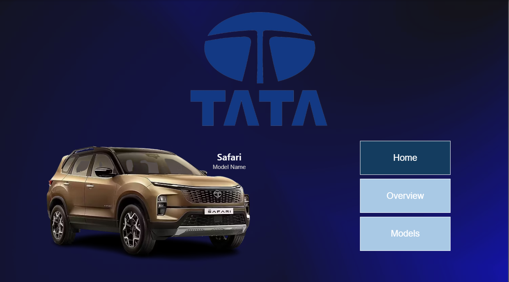
</p>

---

## Project Overview

This project presents a **Business Analytics case study for Tata Motors**, focused on identifying **vehicle models that contribute significantly to revenue but underperform in profitability**.  

Rather than limiting the analysis to descriptive sales reporting, this project approaches the automobile industry from a **business decision-making lens** — helping answer which models should be **scaled, optimized, repositioned, or reviewed** based on their financial and commercial performance.

The project combines **Excel, SQL, and Power BI** to move from raw data to a structured, insight-driven dashboard that supports **portfolio evaluation and strategic decision-making**.

> Power BI File: [`Tata_Motors_Analysis.pbix`](https://github.com/PlexVerse23/Portfolio-Projects/blob/main/TATA%20Motors%20Profitability%20Problem/BI%20File/Tata_Motors_Analysis_Dashboard.pbix)  
> SQL Script: [`tata_motors_analysis.sql`](https://github.com/PlexVerse23/Portfolio-Projects/blob/main/TATA%20Motors%20Profitability%20Problem/SQL%20Transformed/analysis_queries.sql)

---

## Business Problem

Tata Motors offers a diverse vehicle portfolio across multiple markets and customer segments. However, **strong sales volume or revenue does not always translate into strong profitability**.  

Some vehicle models may appear commercially successful on the surface while actually underperforming due to factors such as:

- Weak profit realization
- Inefficient pricing
- High cost burden
- Discount dependency
- Poor product positioning

This project was built to answer a core business question:

> **Which Tata Motors vehicle models are underperforming in profitability despite contributing to revenue?**

---

## Key Business Questions

This analysis was designed to answer the following business questions:

- Which Tata Motors models generate the highest **units sold**, **revenue**, and **profit**?
- Which models are **high-revenue but low-profit**, and can therefore be considered underperformers?
- How does model performance vary across **years** and **countries**?
- Which models contribute significantly to revenue but fail to deliver strong returns?
- What product or customer behavior patterns are associated with underperforming models?
- Which models should Tata Motors **scale, optimize, reposition, or review**?

---

## Dataset Overview

The project was built using three structured datasets:

### 1) `car_finance`
Primary financial and business performance dataset used for:
- units sold
- revenue
- profit
- margins
- pricing ranges
- cost components

### 2) `car_sales`
Commercial and customer behavior dataset used for:
- discounts
- average sale price
- customer ratings
- feedback
- first-time buyer indicators
- loyalty behavior

### 3) `car_specs`
Product and specification dataset used for:
- car type
- fuel type
- horsepower
- torque
- safety rating
- price positioning
- feature analysis

These datasets were used together to create a **multi-layered business view** of Tata Motors’ vehicle portfolio.

---

## Project Workflow

This project was executed in three main stages:

---

### 1) Data Cleaning & Inspection (Excel)

The raw datasets were first inspected and lightly cleaned in Excel to ensure consistency before analysis.

#### Tasks performed:
- Checked for missing values and duplicate records
- Validated key identifiers such as `model_id`
- Reviewed column consistency and formatting
- Removed unnecessary fields for focused analysis
- Prepared clean sheets for SQL import

Excel was used primarily for **inspection and pre-processing**, while all major transformations were performed in SQL.

---

### 2) Data Transformation & Analysis (SQL) - [`Queries`](https://github.com/PlexVerse23/Portfolio-Projects/blob/main/TATA%20Motors%20Profitability%20Problem/SQL%20Transformed/analysis_queries.sql)

SQL was used as the **core analytical engine** of the project.

#### Key work completed in SQL:
- Filtered and structured the data into **analysis-ready views**
    - car_financial_analysis
    - customer_behaviour
    - overall_performance
    - underperformers_dataset
- Created transformed and calculated columns such as:
  - profit per unit
  - profitability ratios
  - model performance categories
- Built **clean analytical views** for:
  - overall financial performance
  - customer behavior analysis
  - underperforming vehicle identification
- Performed exploratory and business-focused analysis to identify:
  - top-performing models
  - underperforming models
  - yearly and country-level trends
  - financial inefficiencies

A **quartile-based model classification approach** was used to segment models into meaningful performance groups.

```
CREATE VIEW overall_performance as
select *,
	CASE 
		when (rev_qtr = 4 or rev_qtr = 3) and (pr_qtr = 4 or pr_qtr = 3) then 'Star'
        when (rev_qtr = 4 or rev_qtr = 3) and (pr_qtr = 1 or pr_qtr = 2) then 'Underperformer'
        when (rev_qtr = 1 or rev_qtr = 2) and (pr_qtr = 4 or pr_qtr = 3) then 'Niche'
        when (rev_qtr = 1 or rev_qtr = 2) and (pr_qtr = 1 or pr_qtr = 2) then 'Weak'
	end as performance
    from(
	select *,
		ntile(4) over (order by total_revenue) as rev_qtr,
		ntile(4) over (order by total_profit) as pr_qtr
		from (
		select 
			model_id, 
			sum(units_sold) as units_sold,
			round(sum(total_revenue), 2) as total_revenue,
			round(sum(profit), 2) as total_profit
		from car_finance
		group by model_id
		) pp1
	) pp2;
  ```

---

### 3) Dashboarding & Visualization (Power BI)

Power BI was used to convert the SQL outputs into an interactive dashboard for **business storytelling and decision support**.

The dashboard was designed to help stakeholders quickly answer:

- Which Tata Motors models are underperforming?
- Where is underperformance most concentrated?
- What product and customer factors may explain it?

---

## Dashboard Walkthrough

This dashboard is structured into **two business-focused pages**, each designed to support a different layer of analysis.

---

### 1. Overview
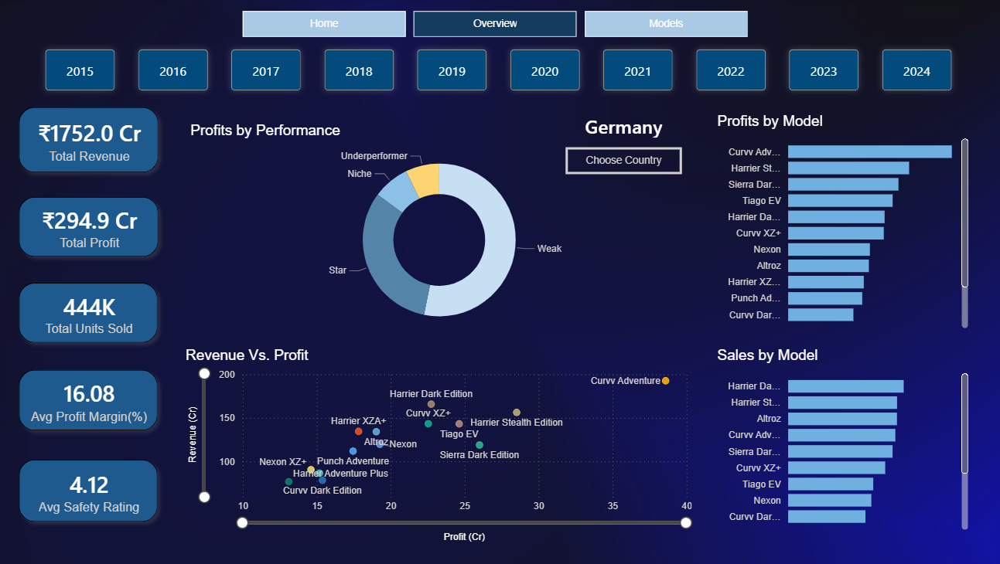

Provides a high-level view of Tata Motors’ vehicle portfolio performance.

- #### Includes KPIs:
<p align="center">
  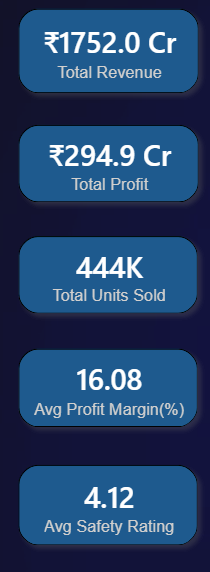
</p>

- #### Visuals:
	- Sales and Profits by Model
<p align="center">
  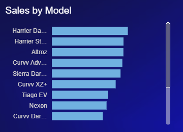
	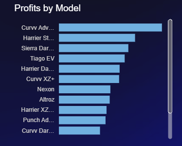
</p>

- #### Revenue vs Profit comparison
<p align="center">
  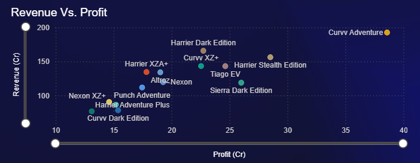
</p>

- #### Model category breakdown
<p align="center">
  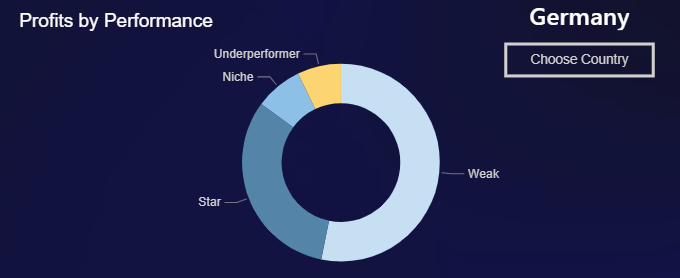
</p>

- #### Slicers for drill-down analysis
#### Year-wise Slicer
<p align="center">
  
</p>

#### Country-wise Slicer
<p align="center">
  
</p>

---

### 2. Models Page

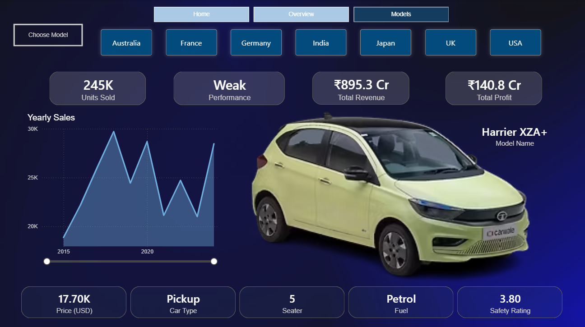

Provides a detailed **model-level analysis** of Tata Motors’ vehicle portfolio, allowing users to explore individual car models across **sales, profitability, specifications, and customer-related attributes**.

#### Includes KPIs (Sales analytics and Vehicle specifications:
<p align="center">
  
</p>

<p align="center">
  
</p>


#### Visuals:
- **Yearly Sales Trend of Selected Model**
<p align="center">
  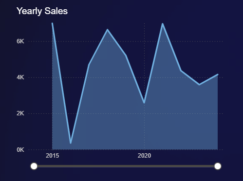
</p>


#### Interactive Filters:
- **Model Selector**
<p align="center">
  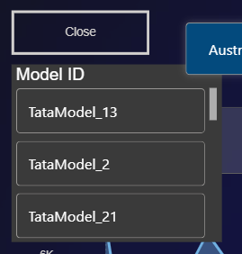
</p>

- **Country-wise Filter**
<p align="center">
  
</p>

- **Performance Category Filter**
  - Best use case along with the model slicer to see what models fall under a specific performance category.
<p align="center">
  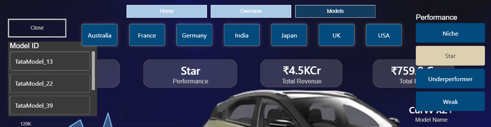
</p>

#### Key Use Case:
This page helps identify how a specific Tata Motors model performs across markets by combining **financial performance**, **sales trends**, and **product specifications** into one focused view.

---

## Key Insights

Some of the most important insights from the project include:

- Several Tata Motors models delivered strong **top-line revenue** but failed to translate that into healthy **bottom-line profitability**, highlighting clear opportunities for **portfolio optimization**.
- Underperforming models were not always low-volume vehicles; in multiple cases, commercially successful models showed **weak profit conversion**, indicating inefficiencies in **cost structure, pricing strategy, or market positioning**.
- **Year-wise and country-wise analysis** revealed that underperformance was not uniformly distributed, helping pinpoint specific **markets and periods** where portfolio returns were weaker.
- **Product attributes** such as **car type, fuel type, pricing band, and positioning** played a meaningful role in shaping financial outcomes, suggesting that profitability is closely linked to both **product mix and customer-market fit**.
- **Model-level yearly sales trends**, combined with country-based filtering, enabled a clearer understanding of how individual vehicles evolved over time and where their **performance trajectory strengthened or declined** across markets.

---

## Business Recommendations

Based on the analysis, the following actions are recommended for Tata Motors:

### 1) Scale High-Performing Models
Increase strategic focus on models that demonstrate strong performance across:
- revenue
- profit
- profitability efficiency

### 2) Optimize Underperforming Revenue Drivers
For high-revenue but low-profit models:
- review pricing strategy
- reduce unnecessary discounting
- improve cost efficiency
- optimize variant mix

### 3) Reposition Weakly Performing Products
For models with reasonable product strength but weaker business performance:
- improve market targeting
- refine customer positioning
- strengthen promotional strategy

### 4) Review Low-Impact Models
For models that are weak across both scale and return:
- reassess their role in the portfolio
- evaluate redesign or rationalization

---

## Tools Used

- **Excel** → Initial inspection and cleaning  
- **MySQL** → Data cleaning, transformation, business analysis, analytical views  
- **Power BI** → Dashboarding, storytelling, and business reporting  

---

# Outcome
This project demonstrates how **business intelligence, data modeling, and dashboard storytelling** can be combined to create a **business-focused portfolio project** with strong analytical and strategic relevance.

It showcases the ability to:
- Build and structure business-ready datasets
- Perform model-level sales, revenue, and profitability analysis
- Design interactive dashboards for drill-down exploration
- Generate decision-support insights for portfolio performance evaluation

---
